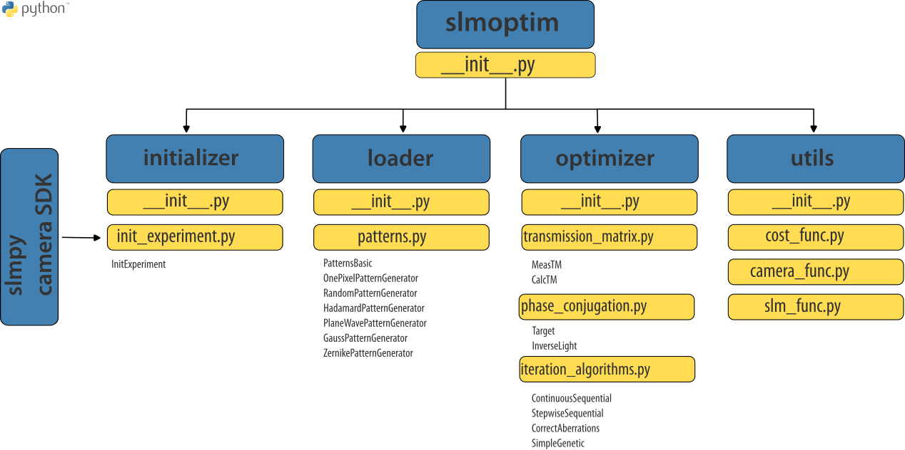
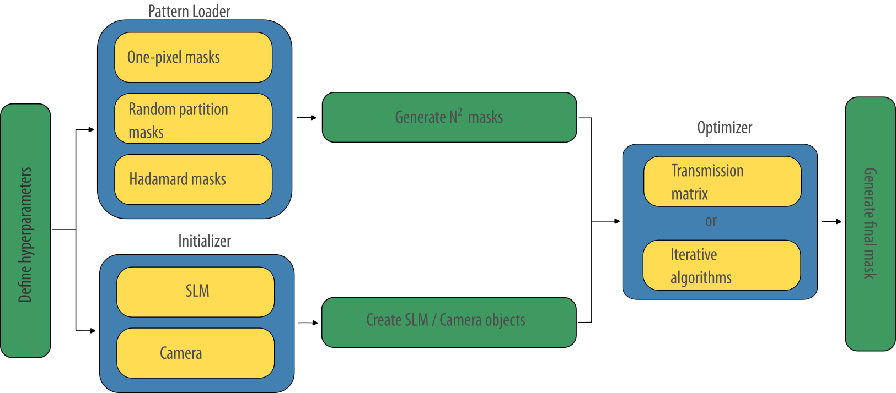

# slmoptim
#### Spatial Light Modulator Optimizer
This is python package that contains a collection of modules that serve to solve an optimization problem in experimental optics. 

The goal is to shape the wavefront of a coherent light source that is subsequently coupled to a vibrant nanoresonator and ultimately optimize the measurement of its motion. 

### Requirements
- This library at this version uses the slmPy package (https://github.com/wavefrontshaping/slmPy) written by S. Popoff which handles an SLM as an external monitor. 
- For these experiments a CMOS USB camera purchased from Thorlabs (Zelux CS165MU) is used. This library uses the TLCameraSDK provided by Thorlabs (https://www.thorlabs.com/software_pages/ViewSoftwarePage.cfm?Code=ThorCam)

### Methods
This package implements two basic wavefront optimization methods: the transmission matrix method and the iterative optimization method.

#### Transmission matrix
Inspired by the work of S. Popoff that first proposed the direct measurement of an optical system's transmission matrix, this package implements a similar method that first acquires the transmission matrix and, second, optimizes the wavefront by means of phase conjugation. 

#### Iterative optimization method
The seminal work of Mosk et al. proposed to use iterative optimization algorithms that maximize (or minimize) a well defined cost function. Here, we implement similar algorithms that can work with any kind of input signal (time series, camera frames)

### Structure and Subpackages
The package structure is organized as follows:

- initializer - initializes the hardware components
- loader - generates patterns for the SLM
- optimizer - optimization methods
- utils - support libraries

This figure illustrates the package structure (subpackages/modules/classes)

### General flowchart

The experimental flowchart should follow this protocol:
- define experimental hyperparameters
- use the initializer to start slm and camera
- use the loader to create pattern masks
- use the optimizer to create an optimization mask

Some jupyter notebooks and scripts are included showcasing how this code can be used. 
